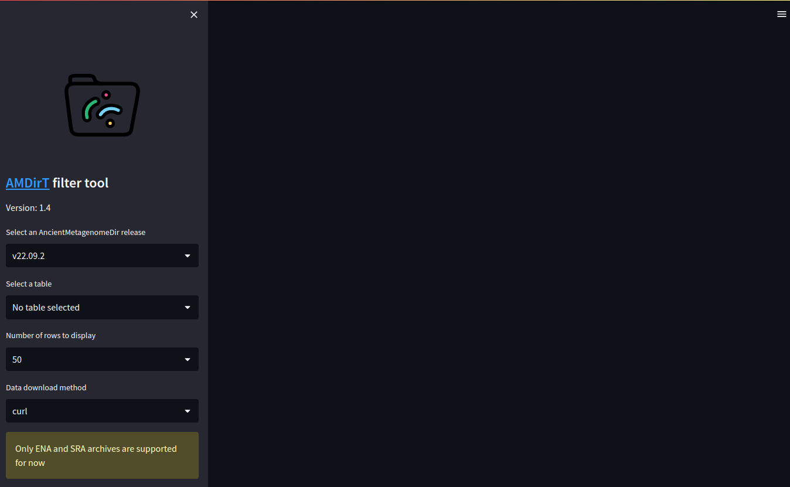
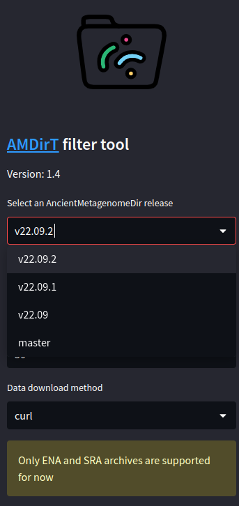
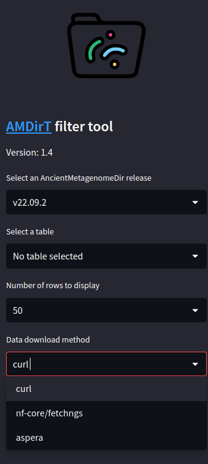
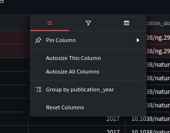
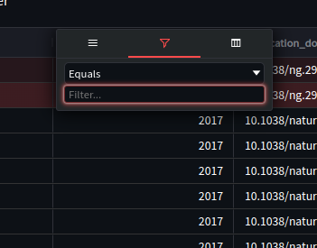
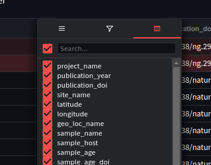
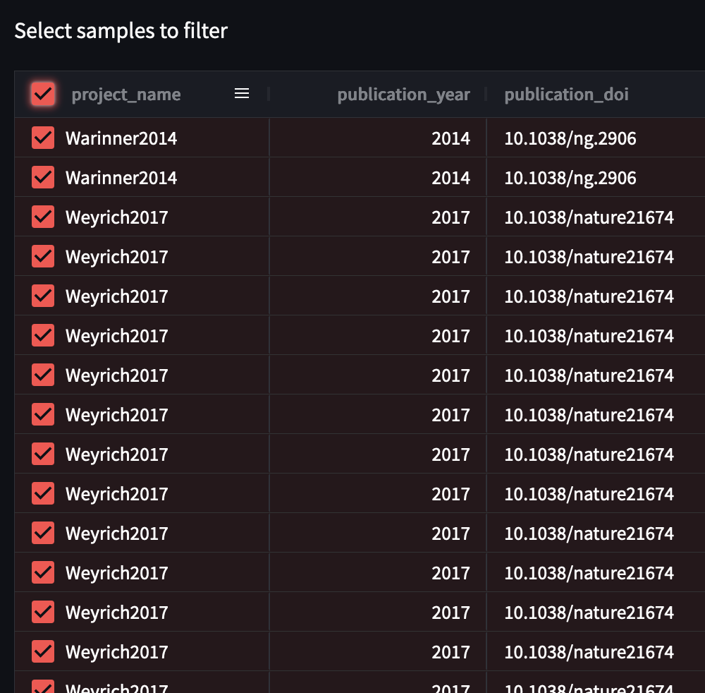
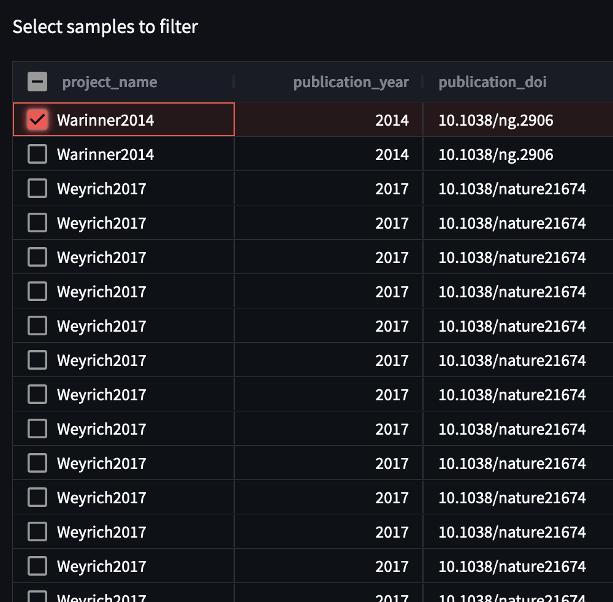
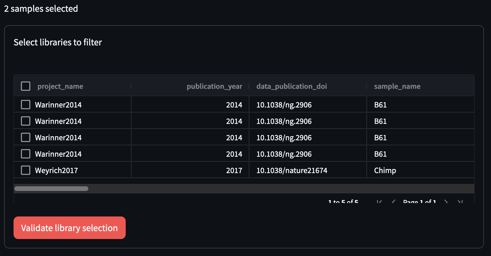
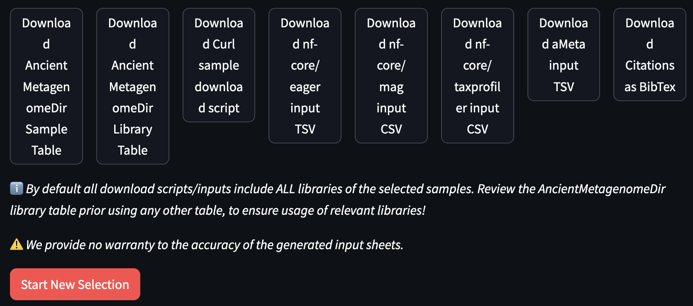

# viewer

## What

The purpose of the `viewer` command is to provide a easy-to-use graphical-user interface to allow users to:

- **explore** the different AncientMetagenomeDir tables via drop down menus
- **filter** a given table based on different criteria using a standard tabular interface
- **download** the resulting sequencing data via different methods
- **download** prepared input samplesheets for pipelines
- **download** citation information of selected samples

> ⚠️ _The `viewer` tool was previously named `filter`, and might still be referred as such in some parts of the documentation._

For video based walkthroughs please see [Tutorials](/tutorials/viewer.md).

## When

You should use this tool when you wish to find particular types of ancient metagenomic data, but wish to explore the dataset manually and interactively (i.e., don't know exactly what you're looking for yet), and/or if you do not wish to download the AncientMetagenomeDir full tables yourself and filter them within languages such as R or Python (with pandas).

## How

### Loading the interface

Before using `AMDirT viewer` make sure you have modern web-browser (Chrome, Firefox, Edge, Safari etc.) available on your machine. This will in most cases be your own laptop or desktop - not a server.

To open the graphical user interface, open a terminal (activating software environments if necessary, see [AMDirT Installation Page](/README)) and run:

```bash
AMDirT viewer
```

Your web-browser should automatically open a new tab and have the `viewer` interface open for you. If your browser does not automatically open, just copy and paste one of the URLs present in the console in your web browsers URL bar.

```text
  Local URL: http://localhost:8501
  Network URL: http://172.0.0.0:8501
```

> ⚠️ _The first time you run the command, you first may get some prompts in your terminal. You can just say 'no' to all - this will not affect the usage of the tool._



Once opened you should see a side bar and a empty pane. You can use the side bar to select various aspects of the displayed data from the AncientMetagenomeDir tables, such as the release, which table you view (e.g., environmental or host-associated metagenomics) and the number of rows to display. The data download option controls which tool the resulting download script will use to get the data.






Once you have selected a version and a table, the table itself should open in the empty pane.

> ℹ️ _In most cases the most recent version is recommended, whereby you pick the most recent date e.g. v22.12 over v22.09 from December and September 2022 respectively_

To help decide which download method to use, see the [Miscellaneous page](miscellaneous.md).
### Exploring the Tables

To navigate the tables you can scroll up and down with your mouse. To side scroll you can hold shift and scroll. To go to the next page of samples, you can find the forward/back buttons in the bottom right of the table to navigate across pages of data entries.

To filter the tables, hover your cursor over the column of interest and you should see a 'hamburger' icon, press this to open the filter and table formatting options.







With this pane and tabs you can:

- Change the size and row ordering of the column (e.g. pin this column to the left or right)
- Filter the rows by various operations on this column (equal, not equal, within range, etc.)
- Change which columns are displayed overall

You can also re-order the order of columns across the table by click and holding the column name, and dragging left and right.

### Exporting Information

Now, select all the samples you wish to download and/or analyse.

You can select all samples currently displayed by clicking the empty box on the project_name column, or you can select individual samples by clicking the empty boxes on these rows in the project_name column.





Now validate your selection! Press the 'Validate selection' button at the bottom of the table.

> ⚠️ _If you wish to download the data, make sure you have already selected your 'Data download method' in the sidebar before pressing 'Validate selection'!_

Once the selection is validated, the library filtering table will appear below



You can proceed to select your libraries of choice (or all of them), and then click on 'Validate library selection'

Your different download options will finally appear:



In this case we suggest you press:

- Download Curl sample download script: contains a bash script with download commands for _all_ the sequencing libraries of the selected samples
- Download nf-core/eager input/tsv: a pipeline input samplesheet: a pre-configured input sheet for a pipeline, based on the downloaded files
- Download citations as BibTex: citation information in BibTex format for selected samples

See [Output](#output) for descriptions of all output possible files.

To use the **download** script, you can simply run:

```bash
bash ancientMetagenomeDir_curl_download_script.sh
```
> ⚠️ _We highly recommend downloading and reviewing `AncientMetagenomeDir_filtered_libraries.tsv` **before** running the curl download script to ensure you have in the download scripts and/or pipeline input sheets only the actual library types you wish to use (e.g. you may only want paired-end data, or non-UDG treated data)._ 

The sequencing files of the selected samples will then have been downloaded to the directory you run the script from.

> ⚠️ _You must already have the download tool you have selected installed and configured on your machine to use the bash script!_

> ⚠️ _Make sure you only run this script on the machine you will run your analyses from, i.e. in most cases on a server or HPC!_

To use the **pipeline input samplesheet**, you should always double check the sheet is correctly configured. Once you have validated it, you can supply it to your selected pipeline as follows (using nf-core/eager as an example):

```bash
nextflow run nf-core/eager <...> --input ancientMetagenomeDir_eager_input.csv
```

The **citations bibtex** file contains all the citation information of your selected samples in a widely used format called BibTex. You can import this file into most referencing or bibliography managing tools (Zotero, Paperpile etc.).

> ⚠️ _Occasionally the cross-ref databases do not have citation information for certain publications. You will receive a warning if so, with the relevant DOIs for you to manually get this information._

### Finishing

If you have finished your selection and file downloading, you can close the interface simply by closing the tab, and then pressing <kbd>Ctrl</kbd> + <kbd>c</kbd> on your terminal.

If you wish to generate a new selection in the same session, you **must** press the 'Start New Selection' button at the bottom of the interface, select the new samples, and press 'Validate selection' again. If you do not press 'Start New Selection', you will export the same set of files and samples from your first selection.

## Output

> ⚠️ _We highly recommend generating and reviewing `AncientMetagenomeDir_filtered_libraries.tsv` **before** downloading or running any pipelines to ensure you have in the download scripts and/or pipeline input sheets only the actual library types you wish to use (e.g. you may only want paired-end data, or non-UDG treated data)._ 

> ⚠️ _To use a **pipeline input samplesheet**, you should always double check the sheet is correctly configured. We cannot guarantee accuracy between metadata and sequencing files._ 

All possible output is as follows:

- `<outdir>`: where all the pipeline samplesheets are placed (by default `.`)
- `AncientMetagenomeDir_bibliography.bib`: 
    - A BibTex format citation information file with all references (where available) present in the filtered sample table.
- `AncientMetagenomeDir_filtered_libraries.tsv`: 
    - The associated AncientMetagenomeDir curated metadata for all _libraries_ of the samples in the input table.
- `AncientMetagenomeDir_curl_download_script.sh`:
    - A bash script containing curl commands for all libraries in the input samples list.
- `AncientMetagenomeDir_aspera_download_script.sh`:
    - A bash script containing Aspera commands for all libraries in the input samples list. See [How Tos](/how_to/miscellaneous) for Aspera configuration information.
- `AncientMetagenomeDir_nf_core_fetchngs_input_table.tsv`: 
    - An input sheet containing ERS/SRS accession numbers in a format compatible with the [nf-core/fetchngs](https://nf-co.re/fetchngs) input samplesheet.
- `AncientMetagenomeDir_nf_core_eager_input_table.tsv`:
    - An input sheet with metadata in a format compatible with the [nf-core/eager](https://nf-co.re/eager) input samplesheet.
    - Contained paths are relative to the directory output when using the `curl` and `aspera` download scripts (i.e., input sheet assumes files are in the same directory as the input sheet itself).
- `AncientMetagenomeDir_nf_core_taxprofiler_input_table.csv`: 
    - An input sheet with metadata in a format compatible with the [nf-core/taxprofiler](https://nf-co.re/eager) input samplesheet.
    - Contained paths are relative to the directory output when using the `curl` and `aspera` download scripts (i.e., input sheet assumes files are in the same directory as the input sheet itself).
- `AncientMetagenomeDir_aMeta_input_table.tsv`:
    - An input sheet with metadata in a format compatible with the [aMeta](https://github.com/NBISweden/aMeta) input samplesheet.
    - Contained paths are relative to the directory output when using the `curl` and `aspera` download scripts (i.e., input sheet assumes files are in the same directory as the input sheet itself).
    - ⚠️ As of version/commit 1a03f3d (and earlier) aMeta does not support paired-end data! For paired-end data you must merge pairs yourself manually before using the sample sheet. 
- `AncientMetagenomeDir_mag_input.zip`: 
    - Input sheets in a format compatible with the [nf-core/mag](https://nf-co.re/eager) input samplesheet.
    - nf-core/mag does not support paired- and single-end data in the same run, therefore paired- and/or input sheets are downloaded as a Zip file that must be extracted before being supplied to the pipeline.
    - Contained paths are relative to the directory output when using the `curl` and `aspera` download scripts (i.e., input sheet assumes files are in the same directory as the input sheet itself).
